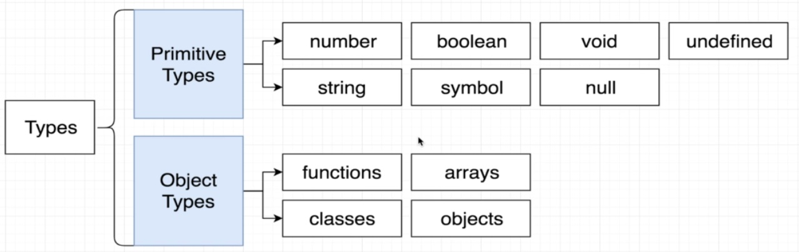
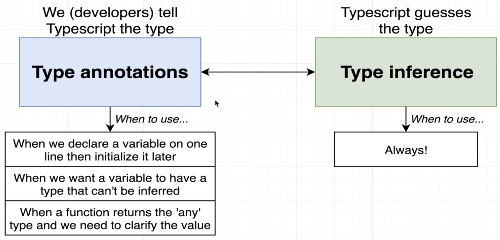
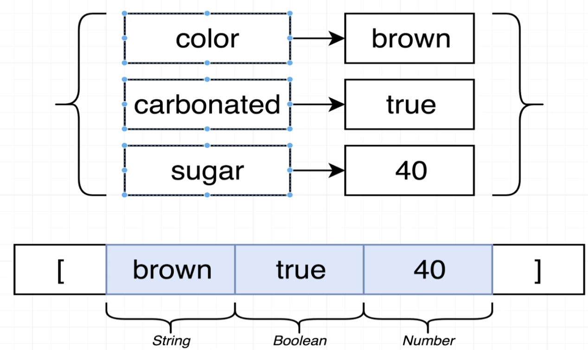

# TYPESCRIPT_THE_COMPLETE_DEV_GUIDE

<details>
  <summary id='table-of-contents' style="padding-bottom: 0.3em; margin-top: 24px; margin-bottom: 16px; font-weight: 600; line-height: 1.25; font-size: 1.5em; border-bottom: 1px solid #D8DEE3;">
    Table of Contents
  </summary>

<!-- Begin Table of Contents GFM -->

- [Links](#links)
- [Config](#config)
  - [Run Compiler](#run-compiler)
- [What is a Type System?](#what-is-a-type-system)
  - [Type](#type)
- [Type Annotations in Action](#type-annotations-in-action)
  - [Type Any](#type-any)
- [Annotations With Functions and Objects](#annotations-with-functions-and-objects)
  - [Interface Around Functions](#interface-around-functions)
  - [Interface for Anonymous Functions](#interface-for-anonymous-functions)
  - [Void and Never](#void-and-never)
  - [Destructuring With Annotations](#destructuring-with-annotations)
  - [Annotations Around Objects](#annotations-around-objects)
- [Arrays](#arrays)
- [Tuples](#tuples)
- [Interfaces](#interfaces)
- [Type Guards](#type-guards)
- [Classes](#classes)
  - [Abstract Classes](#abstract-classes)
- [Enum](#enum)
- [Type Assertion](#type-assertion)
- [Generics](#generics)
  - [Interface Approach](#interface-approach)
    - [Assertions](#assertions)
  - [Functions](#functions)

<!-- End Table of Contents -->

</details>

## Links

- [Typescript: The Complete Developer's Guide](https://www.udemy.com/course/typescript-the-complete-developers-guide)
- [Json Place Holder](https://jsonplaceholder.typicode.com/)

## Config

[☰ Contents](#table-of-contents)

Create a new TypeScript Config

```bash
  tsc --init
```

### Run Compiler

[☰ Contents](#table-of-contents)

To run the TypeScript compiler, use `tsc` command
TypeScript will search and use `tsconfig.json` configuration

- Watch Mode

  ```bash
    tsc -w
  ```

## What is a Type System?

### Type

[☰ Contents](#table-of-contents)

`Type` = Easy way to refer to the different properties + functions that a value has



Why do we care about types?

- Types are used by the TypeScript Compiler to analyze our code for errors.
- Types allow other engineers to understand what values are flowing around our codebase.

## Type Annotations in Action

[☰ Contents](#table-of-contents)

- `Type Annotations`

  - Code we add to tell TypeScript what type of value a variable will refer to

- `Type Inference`

  - TypeScript tries to figure out what type of value a variable refers to



### Type Any

[☰ Contents](#table-of-contents)

- A type, just as `string` or `boolean` are
- Means TS has no idea what this is - can't check for correct property references
- **Avoid variables with `any` at all costs**

  ```typescript
  // 1) Function that returns the `any` type
  const json = '{"x": 10, "y": 20}';
  const coordinates: Point = JSON.parse(json);
  console.log(coordinates);

  // 2) When we declare a variable on one line and initialize it later
  let words = ["red", "green", "blue"];
  let foundWords = false;

  words.forEach((word) => {
    if (word === "green") foundWords = true;
  });

  // 3) Variable whose type cannot be inferred correctly
  let numbers = [-10, -1, 12];
  let numberAboveZero: number | boolean = false;

  number.forEach((num) => {
    if (num > 0) numberAboveZero = num;
  });
  ```

## Annotations With Functions and Objects

[☰ Contents](#table-of-contents)

- `Type Annotations for Functions`

  - Code we add to tell Typescript what type of arguments a function will receive and what type of values it will return

- `Type Inference for Functions`

  - TypeScript tries to figure out what type of value a function will return

### Interface Around Functions

[☰ Contents](#table-of-contents)

```typescript
interface AddFn {
  (a: number, b: number): number;
}

const add: AddFn = (a, b) => {
  return a + b;
};

const add2 = (a: number, b: number): number => {
  return a + b;
};

// TypeScript didn't give us an error
const subtratct = (a: number, b: number) => {
  a - b;
};

function devide(a: number, b: number): number {
  return a / b;
}
```

### Interface for Anonymous Functions

[☰ Contents](#table-of-contents)

```typescript
const multiply = function (a: number, b: number): number {
  return a * b;
};
```

### Void and Never

[☰ Contents](#table-of-contents)

```typescript
const logger = (message: string): void => {
  console.log(message);
};

// Probably never we are going to use in the real world
const throwError = (message: string): never => {
  throw new Error(message);
};

// This is more like a real world scenario
const throwError2 = (message: string): string => {
  if (!message) throw new Error(message);

  return message;
};
const throwError3 = (message: string): void => {
  if (!message) throw new Error(message);
  console.log(message);
};
```

### Destructuring With Annotations

[☰ Contents](#table-of-contents)

```typescript
const todaysWeather = {
  date: new Date(),
  weather: "sunny",
};

const logWeather = (forecast: { date: Date; weather: string }): void => {
  console.log(forecast.date);
  console.log(forecast.weather);
};

logWeather(todaysWeather);
```

```typescript
// ES2015
const logWeather2 = ({
  date,
  weather,
}: {
  date: Date;
  weather: string;
}): void => {
  console.log(date);
  console.log(weather);
};

logWeather2(todaysWeather);

interface LogWeather3Fn {
  (forecast: { date: Date; weather: string }): void;
}
const logWeather3: LogWeather3Fn = ({ date, weather }) => {
  console.log(date);
  console.log(weather);
};

logWeather3(todaysWeather);

type Forecast = {
  date: Date;
  weather: string;
};

interface LogWeather4Fn {
  (forecast: Forecast): void;
}
const logWeather4: LogWeather4Fn = ({ date, weather }) => {
  console.log(date);
  console.log(weather);
};

logWeather4(todaysWeather);
```

### Annotations Around Objects

[☰ Contents](#table-of-contents)

```typescript
const profile = {
  name: "Roger",
  age: 36,
  coords: {
    lat: 0,
    lng: 15,
  },
  setAge(age: number): void {
    this.age = age;
  },
};

const { age, name: firstName }: { age: number; name: string } = profile;
const {
  coords: { lat, lng },
}: { coords: { lat: number; lng: number } } = profile;
```

## Arrays

[☰ Contents](#table-of-contents)

Array where each element is some consistent type of value.

- Why do we care?

  - TS can do type inference when extracting values from an array
  - TS can prevent us from adding incompatible values to the array
  - We can get help with `map`, `forEach`, `reduce` functions
  - Flexible - arrays can still contain multiple different types

- Where to use typed arrays?

  - Any time we need to represent a collection of records with some arbitrary sort order

```typescript
const carMakers: string[] = ["ford", "tyota", "chevy"];
const dates = [new Date(), new Date(), new Date()];

// Two dimensional array
const carsByMake: string[][] = [["f150"], ["corola"], ["camaro"]];

// Help with inference when extracting values
const car = carMakers[0];
const myCar = carMakers.pop();

// Prevent incompatible values
carMakers.push(100); //Argument of type 'number' is not assignable to parameter of type 'string'.

// Help with `map`
carMakers.map((car: string): string => {
  return car.toUpperCase();
});

// Flexible types
const importantDates: (Date | string)[] = [new Date()];
importantDates.push("2023-10-10");
importantDates.push(new Date());
```

## Tuples

[☰ Contents](#table-of-contents)

Array-like structure where each element represents some property of a record



```typescript
const drink = {
  color: "brown",
  carbonated: true,
  sugar: 40,
};

// Tuple
const pepsi: [string, boolean, number] = ["brown", true, 40];

pepsi[0] = 40; // Type 'number' is not assignable to type 'string'.

// Type alias
type Drink = [string, boolean, number];

const sprite: Drink = ["white", true, 30];
```

## Interfaces

[☰ Contents](#table-of-contents)

General strategy for reusable code in TS

- Create functions that accept arguments that are types with interfaces
- Objects/classes can decide to `implement` a given interface to work with a function

```typescript
interface Vehicle {
  name: string;
  year: Date;
  broken: boolean;
  summary(): string;
}

interface Reportable {
  summary(): string;
}

const oldCivic = {
  name: "civic",
  year: new Date(),
  broken: true,
  summary() {
    return `Name: ${this.name}`;
  },
};

const drink2 = {
  color: "brown",
  carbonated: true,
  sugar: 40,
  summary() {
    return `My drink has ${this.sugar} grams of sugar`;
  },
};

const printSummary = (item: Reportable): void => {
  console.log(item.summary());
};

printSummary(oldCivic);
printSummary(drink2);
```

## Type Guards

[☰ Contents](#table-of-contents)

- **typeof**

  - Narrow type of value to a primitive type
    - number
    - string
    - boolean
    - symbol

- **instanceof**

  - Narrow down every other type of value
  - Every other value that is create with a constructor function

```typescript
class Sorter {
  constructor(public collection: number[] | string) {}

  sort(): number[] | string {
    const { length } = this.collection;

    if (this.collection instanceof Array) {
      // collection === []
      for (let i = 0; i < length; i++) {
        for (let j = 0; j < length - i - 1; j++) {
          if (this.collection[j] > this.collection[j + 1]) {
            const leftHand = this.collection[j];
            this.collection[j] = this.collection[j + 1];
            this.collection[j + 1] = leftHand;
          }
        }
      }
      return this.collection;
    }

    return this.collection;
  }
}

const sorter = new Sorter([10, 3, -5, 0]);
console.log(sorter.sort());
```

## Classes

[☰ Contents](#table-of-contents)

- TypeScript Class vs JavaScript Class

  - **Modifiers**
    - `public`: this method can be called any where, any time
    - `private`: this method can only be called by other methods in `this` class
    - `protected`: this method can be called by other methods in `this` class, or by other methods in child classes

```typescript
class Vehicle {
  color: string;

  constructor(color: string) {
    this.color = color;
  }

  protected honk(): void {
    console.log("beep");
  }
}

class VehicleShortcut {
  constructor(public color: string) {}

  protected honk(): void {
    console.log("beep");
  }
}

const vehicle = new Vehicle("red");
console.log(vehicle.color);

const vehicle2 = new VehicleShortcut("red");
console.log(vehicle2.color);

class Car extends Vehicle {
  constructor(
    public wheels: number,
    color: string,
  ) {
    super(color);
  }

  private drive(): void {
    console.log("vroom");
  }

  startDrivingProcess(): void {
    this.drive();
    this.honk();
  }
}

const car1 = new Car(4, "orange");
car1.startDrivingProcess();
```

### Abstract Classes

- Can't be used to create an object directly
- Only used as a parent class
- Can contain real implementation for some methods
- The implemented methods can refer to other methods that don't actually exist yet (we still have to provide names and types for the un-implemented methods)
- Can make child classes promise to implement some other method

- **Interfaces vs Inheritance/Abstract Class**

  - Interfaces

    - Sets up a contract between different classes
    - Use when we have a very different different objects that we want to work together
    - Promotes loose coupling

  - Inheritance/Abstract Class

    - Sets up a contract between different classes
    - Use when we are trying to build up a definition of an object
    - Strongly couples classes together

- Abstract Class

  ```typescript
  // Abstract class
  export abstract class Sorter {
    abstract length: number;
    abstract compare(leftIdx: number, rightIdx: number): boolean;
    abstract swap(leftIdx: number, rightIdx: number): void;

    sort(): void {
      const { length } = this;

      for (let i = 0; i < length; i++) {
        for (let j = 0; j < length - i - 1; j++) {
          if (this.compare(j, j + 1)) {
            this.swap(j, j + 1);
          }
        }
      }
    }
  }
  ```

- Other classes

  ```typescript
  import { Sorter } from "./Sorter";

  export class NumberCollection extends Sorter {
    constructor(public data: number[]) {
      super();
    }

    // Getter
    get length(): number {
      return this.data.length;
    }

    compare(leftIdx: number, rightIdx: number): boolean {
      return this.data[leftIdx] > this.data[rightIdx];
    }

    swap(leftIdx: number, rightIdx: number): void {
      const leftHand = this.data[leftIdx];
      this.data[leftIdx] = this.data[rightIdx];
      this.data[rightIdx] = leftHand;
    }
  }
  ```

  ```typescript
  import { Sorter } from "./Sorter";

  export class CharactersCollection extends Sorter {
    constructor(public data: string) {
      super();
    }

    // Getter
    get length(): number {
      return this.data.length;
    }

    compare(leftIdx: number, rightIdx: number): boolean {
      return (
        this.data[leftIdx].toLowerCase() > this.data[rightIdx].toLowerCase()
      );
    }

    swap(leftIdx: number, rightIdx: number): void {
      const characters = this.data.split("");
      const leftHand = characters[leftIdx];
      characters[leftIdx] = characters[rightIdx];
      characters[rightIdx] = leftHand;
      this.data = characters.join("");
    }
  }
  ```

  ```typescript
  import { Sorter } from "./Sorter";

  class Node {
    next: Node | null = null;

    constructor(public data: number) {}
  }

  export class LinkedList extends Sorter {
    head: Node | null = null;
    private len: number;

    constructor() {
      super();
      this.len = 0;
    }

    add(data: number): void {
      const node = new Node(data);

      if (!this.head) {
        this.head = node;
        return;
      }

      let tail = this.head;
      if (!this.len) this.len = 1;

      while (tail.next) {
        tail = tail.next;
      }

      tail.next = node;
      this.len += 1;
    }

    // Getter
    get length(): number {
      return this.len;
    }

    at(idx: number): Node {
      if (!this.head) throw new Error("Idx out of bounds");

      let count = 0;
      let node: Node | null = this.head;

      while (node) {
        if (count === idx) return node;
        count += 1;
        node = node.next;
      }

      throw new Error("Idx out of bounds");
    }

    compare(leftIdx: number, rightIdx: number): boolean {
      if (!this.head) throw new Error("List is empty");
      return this.at(leftIdx).data > this.at(rightIdx).data;
    }

    swap(leftIdx: number, rightIdx: number): void {
      const leftNode = this.at(leftIdx);
      const rightNode = this.at(rightIdx);

      const leftHand = leftNode.data;
      leftNode.data = rightNode.data;
      rightNode.data = leftHand;
    }

    print(): void {
      if (!this.head) return;

      let node: Node | null = this.head;

      while (node) {
        console.log(node.data);
        node = node.next;
      }
    }
  }
  ```

- Index

  ```typescript
  import { NumberCollection } from "./NumberCollection";
  import { CharactersCollection } from "./CharactersCollection";
  import { LinkedList } from "./LinkedList";

  const numberCollection = new NumberCollection([10, 3, -5, 0]);
  numberCollection.sort();
  console.log(numberCollection);

  const charCollection = new CharactersCollection("Xaayb");
  charCollection.sort();
  console.log(charCollection);

  const linkedList = new LinkedList();
  linkedList.add(500);
  linkedList.add(-10);
  linkedList.add(-3);
  linkedList.add(4);
  linkedList.sort();
  linkedList.print();
  ```

## Enum

[☰ Contents](#table-of-contents)

- Follow near-identical syntax rules as normal objects
- Creates an object with the same keys and values when converted from TS to JS
- Primary goal is to signal to other engineers that these are all closely related values
- Use whenever we have a small fixed set of values that are all closely related and known at compile time

  ```typescript
  enum MatchResult {
    HomeWin = "H",
    AwayWin = "A",
    Draw = "D",
  }
  ```

## Type Assertion

[☰ Contents](#table-of-contents)

```typescript
import fs from "fs";
import { MatchResult } from "./MatchResult";
import { dateStringToDate } from "./utils";

type Data = [Date, string, string, number, number, MatchResult, string];

export class CsvFileReader {
  public data: Data[] = [];

  constructor(public filename: string) {}

  read(): void {
    this.data = fs
      .readFileSync(this.filename, { encoding: "utf-8" })
      .split("\n")
      .map((row: string): string[] => row.split(","))
      .map((item: string[]): Data => {
        return [
          dateStringToDate(item[0]),
          item[1],
          item[2],
          parseInt(item[3]),
          parseInt(item[4]),
          item[5] as MatchResult,
          item[6],
        ];
      });
  }
}
```

## Generics

[☰ Contents](#table-of-contents)

- Like function arguments, but for types in class/function definition
- Allow us to define the type of a property/argument/return at a future point
- Used heavily when writing reusable code

  ```typescript
  import fs from "fs";

  export abstract class CsvFileReader<T> {
    public data: T[] = [];

    constructor(public filename: string) {}

    abstract mapRow(item: string[]): T;

    read(): void {
      this.data = fs
        .readFileSync(this.filename, { encoding: "utf-8" })
        .split("\n")
        .map((row: string): string[] => row.split(","))
        .map(this.mapRow);
    }
  }
  ```

  ```typescript
  import { CsvFileReader } from "./CsvFileReader";
  import { MatchResult } from "./MatchResult";
  import { dateStringToDate } from "./utils";

  type MatchData = [Date, string, string, number, number, MatchResult, string];

  export class MatchReader extends CsvFileReader<MatchData> {
    mapRow(item: string[]): MatchData {
      return [
        dateStringToDate(item[0]),
        item[1],
        item[2],
        parseInt(item[3]),
        parseInt(item[4]),
        item[5] as MatchResult,
        item[6],
      ];
    }
  }
  ```

  ```typescript
  import { MatchReader } from "./MatchReader";
  import { MatchResult } from "./MatchResult";

  const reader = new MatchReader("football.csv");
  reader.read();
  let manUnitedWins = 0;

  for (let match of reader.data) {
    const [date, homeTeam, otherTeam, homeScore, otherScore, winner, other] =
      match;

    if (homeTeam === "Man United" && winner === MatchResult.HomeWin)
      manUnitedWins += 1;

    switch (true) {
      case homeTeam === "Man United" &&
        (winner === MatchResult.HomeWin || winner === MatchResult.AwayWin):
        manUnitedWins += 1;
        break;
      default:
        break;
    }
  }

  console.log(`Man United won ${manUnitedWins} games`);
  ```

### Interface Approach

[☰ Contents](#table-of-contents)

```typescript
import fs from "fs";

export class CsvFileReader {
  data: string[][] = [];

  constructor(public filename: string) {}

  read(): void {
    this.data = fs
      .readFileSync(this.filename, {
        encoding: "utf-8",
      })
      .split("\n")
      .map((row: string): string[] => {
        return row.split(",");
      });
  }
}
```

```typescript
import { dateStringToDate } from "./utils/utils";
import { MatchResult } from "./types/MatchResult";

type MatchData = [Date, string, string, number, number, MatchResult, string];

interface DataReader {
  read(): void;
  data: string[][];
}

export class MatchReader {
  matches: MatchData[] = [];

  constructor(public reader: DataReader) {}

  load(): void {
    this.reader.read();
    this.matches = this.reader.data.map((item): MatchData => {
      return [
        dateStringToDate(item[0]),
        item[1],
        item[2],
        parseInt(item[3]),
        parseInt(item[4]),
        item[5] as MatchResult,
        item[6],
      ];
    });
  }
}
```

```typescript
import { MatchReader } from "./MatchReader";
import { CsvFileReader } from "./CsvFileReader";
import { MatchResult } from "./types/MatchResult";

const csvFilleReader = new CsvFileReader("football.csv");
const matchReader = new MatchReader(csvFilleReader);
matchReader.load();
let manUnitedWins = 0;

for (let match of matchReader.matches) {
  const [date, homeTeam, otherTeam, homeScore, otherScore, winner, other] =
    match;

  if (homeTeam === "Man United" && winner === MatchResult.HomeWin)
    manUnitedWins += 1;

  switch (true) {
    case homeTeam === "Man United" &&
      (winner === MatchResult.HomeWin || winner === MatchResult.AwayWin):
      manUnitedWins += 1;
      break;
    default:
      break;
  }
}

console.log(`Man United won ${manUnitedWins} games`);
```

#### Assertions

[☰ Contents](#table-of-contents)

```typescript
class ArrayOfNumbers {
  constructor(public collection: number[]) {}

  get(index: number): number {
    return this.collection[index];
  }
}

class ArrayOfStrings {
  constructor(public collection: string[]) {}

  get(index: number): string {
    return this.collection[index];
  }
}

class ArrayOfAnything<T> {
  constructor(public collection: T[]) {}

  get(index: number): T {
    return this.collection[index];
  }
}

new ArrayOfAnything<string>(["a", "b", "c"]);
new ArrayOfAnything<number>([1, 2, 3]);

const arrOfNumbers = new ArrayOfAnything(["a", "b", "c"]);
const arrOfStrings = new ArrayOfAnything([1, 2, 3]);
```

### Functions

[☰ Contents](#table-of-contents)

```typescript
function printStrings(arr: string[]): void {
  for (let i = 0; i < arr.length; i++) {
    console.log(arr[i]);
  }
}

function printNumbers(arr: number[]): void {
  for (let i = 0; i < arr.length; i++) {
    console.log(arr[i]);
  }
}

function printAnything<T>(arr: T[]): void {
  for (let i = 0; i < arr.length; i++) {
    console.log(arr[i]);
  }
}

printAnything<number>([1, 2, 3]);
printAnything<string>(["a", "b", "c"]);

printAnything([1, 2, 3]);
printAnything(["a", "b", "c"]);
```
